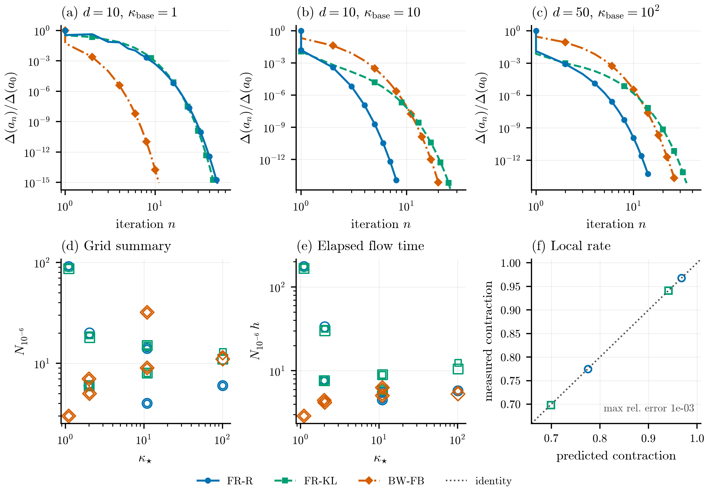

# Gaussian Variational Inference via Fisher-Rao Gradient Flows

A reproducible NumPy/SciPy reference implementation for the numerical experiments
in the manuscript *Gaussian variational inference via Fisher-Rao gradient flows*.
The repository includes deterministic and stochastic Gaussian variational-inference
algorithms, resumable experiment campaigns, numerical validation, and
publication-ready figures.



## The manuscript campaign

The figures of the paper come from a reduced, preregistered campaign of 131
deterministic trajectories, separate from the exploratory grids. Three experiment
groups produce three figures: Gaussian structure and affine invariance, global-to-local
convergence on non-Gaussian targets, and deterministic Bayesian logistic regression.
Only `FR--R`, `FR--KL` and `FB--GVI` iterate, with `Laplace` as a non-iterative
reference.

```bash
make manuscript-pilot     # sweep the two pilot cells, freeze the stepsizes
make manuscript-configs   # instantiate the 87 configs
make manuscript-runs      # 131 trajectories
make manuscript-figures   # figures 1-3 plus the width and font audit
make manuscript-tables
make manuscript-audit
```

The protocol, the frozen stepsizes and the deviations from the plan it was written
against are documented in [the protocol note](reports/MANUSCRIPT_PROTOCOL.md).
Every figure carries a provenance JSON naming its panels, their config identifiers
and the commit; every panel carries its processed CSV.

## Highlights

- Float64 numerical implementation with symmetric eigendecompositions for SPD
  matrix functions.
- Resumable, hash-validated campaigns that retain completed and failed seeds.
- Per-method stepsize sweeps based on optimizer-whitened curvature constants.
- Matching PDF and PNG figures on exact 6.5-inch manuscript-width canvases, with
  embedded fonts and colorblind-safe method encodings.
- Unit, integration, regression, numerical-results, and plot-audit gates.

## Implemented methods

| Method | Role |
|---|---|
| FR-R, FR-KL | Deterministic Fisher-Rao Riemannian-retraction and KL/Bregman schemes |
| FR-R-STL, FR-KL-STL | Stochastic Price/Hessian sticking-the-landing variants |
| FB-GVI, S-FB-GVI | Deterministic and minibatch Bures-Wasserstein baselines from [Diao et al.](https://arxiv.org/abs/2304.05398) |
| Laplace | Non-iterative logistic-regression approximation baseline |
| Affine-invariant metric family | Section 5 classification-verification tool, excluded from the main comparison |

The Bures-Wasserstein comparison is deliberately restricted to FB-GVI and
S-FB-GVI. Invalid covariance updates are recorded as failures; algorithms are
never stabilized by covariance eigenvalue clipping or silent stepsize reduction.

## Experiments

| Experiment | Mechanism |
|---|---|
| A | Covariance burn-in in whitened coordinates |
| B | Affine equivariance of the iterates |
| C | Anisotropic Gaussian benchmark with `kappa = 1e9` and `kappa_star = 1` |
| D | Strongly log-concave non-Gaussian grid |
| F | Exact Gaussian local region and sharp threshold |
| G | Near-Gaussian local spectral rate |
| H | Gaussian STL pathwise cancellation |
| I | Raw-score versus STL estimator variance |
| J | Minibatch residual floors versus batch size |
| K | Decreasing-stepsize schedule |
| L | Bayesian logistic regression |
| M | Modal rates of the affine-invariant metric family |

## Quick start

Requirements: Linux or macOS, Python 3.11-3.13, and approximately 8 GB of RAM
for the full campaign. No GPU is required.

From the repository root:

```bash
./scripts/bootstrap_env.sh
make test
make smoke
```

The bootstrap script creates `.venv`, installs the package and development
dependencies, and checks the environment. The smoke tier exercises the experiment,
plotting, table, and audit paths end to end.

## Running the campaign

```bash
make configs
CAMPAIGN_JOBS=64 OVERNIGHT_BUDGET_HOURS=8 make full
CAMPAIGN_JOBS=64 make resume
make figures
./scripts/audit_results.sh --allow-failed
```

- `make configs` regenerates the committed full-tier grids.
- `make full` runs the campaign with config-level parallelism.
- `make resume` skips jobs whose config and numerical-source hashes still match.
- `make figures` regenerates figures and tables from locally saved results without
  rerunning experiments.
- The retained-failure audit mode accepts deliberately unstable sweep points while
  continuing to check covariance positivity, method exclusions, provenance, and
  pathwise covariance bands.

Set `CAMPAIGN_JOBS` to a suitable value for the available CPU and memory. The run
scripts already restrict BLAS libraries to one thread per worker.

## Results and reproducibility

The three manuscript figures are `results/figures/manuscript/figure_1.{pdf,png}`
through `figure_3.{pdf,png}`, each with a caption draft, a provenance JSON and one
processed CSV per panel under `results/processed/manuscript/`. The exploratory
campaign additionally produces the older `main_figure_*` composites and one figure
per experiment.

Every run manifest records the configuration and source hashes, git state,
platform and package versions, BLAS configuration, seeds, curvature constants,
operation accounting, status, failure reason, and output paths. Raw trajectories
retain individual seeds. Large full-tier trajectories and manifests are ignored by
git because they are resumable and regenerable.

## Numerical safeguards

- Numerical work is performed in float64.
- SPD matrix functions use symmetric eigendecompositions; linear solves use
  Cholesky factors where appropriate.
- Deterministic methods in a cell share one fixed expectation design with the
  reference solve.
- Unstable steps are retained as failed runs rather than repaired by algorithmic
  clipping.
- The validation suite must pass before an expensive campaign is launched.

## Repository layout

```text
src/fr_gvi/       algorithms, targets, diagnostics, experiments, and plotting
configs/          smoke, generated full-tier, and manuscript experiment configurations
scripts/          environment, campaign, resume, figure, and audit entry points
tests/            unit, integration, and regression validation
results/          tracked headline artifacts and local campaign outputs
reports/          protocol, implementation, audit, campaign, and reproduction notes
```

## Documentation

- [Manuscript numerical protocol](reports/MANUSCRIPT_PROTOCOL.md)
- [Reproduction guide](reports/REPRODUCIBILITY.md)
- [Implementation notes](reports/IMPLEMENTATION_NOTES.md)
- [Numerical audit](reports/NUMERICAL_AUDIT.md)
- [Campaign summary](reports/OVERNIGHT_SUMMARY.md)
